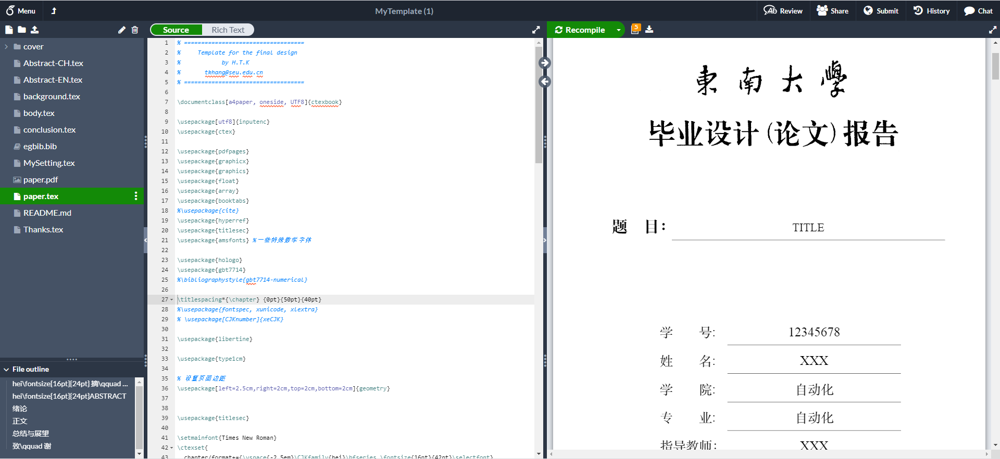
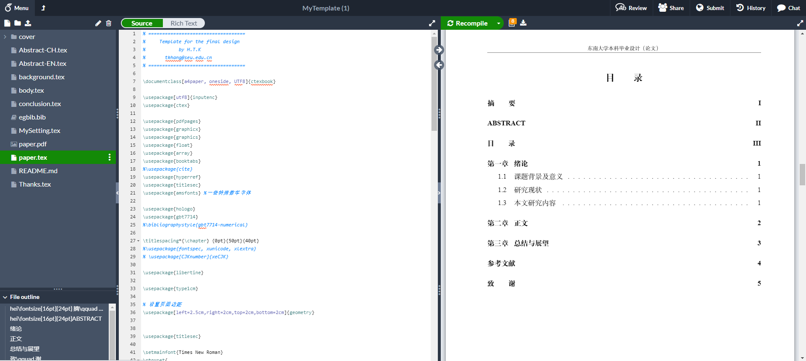

# MyTemplate
My latex template for seuthesis-2020

## 使用overleaf
将文件打包上传至**overleaf**. 选择 **XeLaTeX** 编译器.texlive版本为2019.

！！！注意，该模板针对texlive2019有效，但是对texlive2020 标题显示有问题。（尚未解决）

## 使用VS code

编译顺序为：**xelatex->bibtex->xelatex->xelatex**

## overleaf效果

